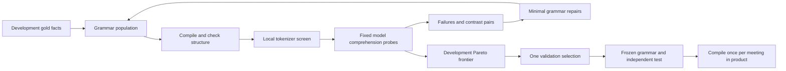

# Tokenese: evolutionary language discovery and semantic repair

Status: implementation plan, not implemented or evaluated.

This is the active direction following the user's clarification that creativity matters more than maximizing savings through conventional techniques. It supersedes the implementation order in the earlier V2 cost revision. The original V2 documents remain useful evaluation references.

**Product hypothesis:** an application can discover a compact language that an existing, unmodified LLM understands, then repair the language's weaknesses using counterexamples. The deployed compiler deterministically translates meeting facts into that language. The decoder is the existing LLM; no model training or grammar legend is required.

**Demonstration:** English → evolving grammar → semantic failure → minimal repair → successful answers on unseen meetings, with actual input-token and cost measurements.

**Scientific boundary:** this discovers a useful grammar within a bounded search space. It does not discover a globally optimal language, guarantee lossless meaning, or establish that this approach is unprecedented.

## Decisions and scope

- Retain `gpt-4.1-mini-2025-04-14` as the reference answerer and extractor. Record the tokenizer name, installed tokenizer version, prompt/schema hashes, and model on every experiment. Qualify a different model separately.
- Use the existing five fact kinds for the MVP: action, proposal, decision, agreement, disagreement. Keep owner, task, deadline, negation, and source evidence. Adding blockers/statuses/open questions is an extension after the core experiment works.
- Evolve the representation, not the answer instruction, output schema, extractor, or question wording. The compiler receives facts and a grammar, never a question or gold answer.
- Keep facts in source order. Within-fact word order may evolve. Permit grouping only for consecutive compatible facts, with explicit boundaries and reversible field inheritance.
- Keep all literal field values unchanged in the MVP. No arbitrary deletion, invented aliases, date shortening, name substitution, or rewriting task text. Symbols and multilingual terms may express structural roles, never replace literal content.
- Keep grammar definitions in the application for compilation and inspection. Do not send the grammar specification, legend, successful examples, or repair history to the answer model in the primary experiment.
- Use deterministic local mutations first. A bounded optional model proposer can introduce structural lexemes, but produces validated data only; never generate or execute renderer code.
- Preserve V1 files, behavior, and historical reports. New modules use an `evo_` prefix. Reuse `Fact`, `MeetingFacts`, `Answer`, `count_tokens`, and `grade_exact` where their existing contracts suffice.
- Ordinary caching, batching, compression tools, and retrieval are comparisons or supporting mechanics. They are not the project's main creative claim.

## Architecture



### Grammar contract

`GrammarSpec` is immutable, JSON-serializable data with a content-derived ID. Its fields describe:

| Field | Allowed behavior |
| --- | --- |
| `kind_forms` | Map each of the five kinds to a structural word/phrase/symbol |
| `layout` | One of a small set of typed clause layouts, such as actor–kind–content or kind–content–actor |
| `field_markers` | Explicit owner/deadline markers from a bounded vocabulary |
| `separators` | Fact, clause, and field boundaries, with deterministic escaping |
| `grouping` | None, or consecutive same-kind/same-owner groups with explicit inheritance |
| `repairs` | At most four general structural rules, each tied to a supported semantic distinction |

This goes beyond V2's fixed Cartesian formatting catalog through compositional grouping, inherited fields, mutation lineage, and feedback-generated repair rules. The number of profiles is not the novelty claim.

The renderer emits a `CompiledText` containing `text`, source fact/span references, and a trace from emitted segments to source fields. A deterministic parser for the grammar reconstructs the ordered semantic projection `(kind, person, text, deadline)` from **text alone plus GrammarSpec**, not from the trace. Require exact round-trip equality, including fact multiplicity. Source quotes remain local evidence and are not part of the answer context by default.

Round-trip checks certify preservation under our own grammar. They do not certify that the LLM interprets it correctly; model QA is the separate comprehension test. Unsupported delimiters, ambiguous layouts, noninvertible inheritance, or unsafe symbols reject the grammar.

### Repair contract

A repair changes a grammar rule, not a particular meeting or answer. Example: a cheap marker for proposals is confused with a decision; replace it with an explicit proposal term, then try shorter alternatives. Another example is adding an owner label where a layout confuses the speaker with an assignee.

`RepairRecord` stores parent/child grammar IDs, failed development question IDs, a suspected error category, the actual structural edit, additional tokens, before/after answers, and regression results. A suspected cause is a hypothesis until the controlled edit improves the relevant probes. Rules may condition on kind or field presence; they may not contain meeting IDs, question text, names, deadlines, or expected answers.

## Data and evaluation

Create `data/evolution/dev.json`, `validation.json`, and `test.json`, plus a manifest. Target 12 source-disjoint meetings per split and ten checked questions per meeting: 120 questions per split. Use public, attributed source material, with a mix of short notes and longer excerpts. Track source meeting/series IDs and avoid cross-split source overlap. Existing V1 examples are development diagnostics only.

Start with four development meetings and a 16-question probe so the language loop can be built early. The full corpus is required for the release gate; a smaller result is explicitly a pilot. Never claim human or second-person review that has not happened. Complete independent validation/test annotation review when available; otherwise release status remains `incomplete_evaluation`.

Each question has a stable ID, accepted answers, expected `found`, critical category, and supporting source references. Cases carry notes, gold facts, provenance, and review status. Negative/unknown cases must be checked against the entire supplied excerpt.

Create up to 40 additional **development-only** counterexample questions, labeled by reviewed deterministic transformations. Cover:

- proposal versus decision;
- explicit rejection versus no recorded decision;
- actor/speaker versus action assignee;
- `Friday` versus `next Friday` and `this Friday`;
- negated versus affirmative task content;
- the same task assigned to different people;
- empty fields, repeated names, and repeated facts;
- boundary ambiguity when grouping adjacent facts;
- conflicting or revised statements, with an explicit accepted answer or abstention.

For a contrast pair, change a single semantic distinction and specify the corresponding gold answer change. Name swaps test whether the grammar generalizes beyond familiar names. Transform source text, facts, and labels consistently. Ambiguous automated edits are rejected for manual review. Learned/model-generated counterexamples are not automatically ground truth.

Keep validation/test in separate files; search receives only the development path. Hash manifests and record which split each command loaded. Once validation selects a winner, do not resume mutation using validation failures. Once test is opened, do not edit the selected grammar from its results.

### Two independent success gates

**Language gate:** on validation and again on test, at least 119/120 exact gold-fact answers; no new critical error on any question that either English fact baseline answers correctly; no integrity failures; and lower aggregate actual answer input than both explicit prose facts and existing compact English facts. Raw-note quality and cost are additional comparisons. This isolates representation from extraction and from removal of transcript filler.

**Product gate:** on the parsed-fact path, at least 119/120 exact answers with no new critical errors against raw and parsed-English baselines. Report extraction cost once per meeting, all answer usage, and workflow savings at one, four, and ten questions. Product savings qualify only for the measured workload where total cost actually falls. A language win may coexist with no product break-even.

All wrong abstentions and missing/invalid answers count as failures. Use exact critical-field grading, not embedding similarity or an LLM judge as the release authority. The observed 119/120 threshold is not a statistical guarantee. Report per-meeting results and distinguish gold-fact, parsed-fact, and public-source evidence.

## File map

| File | Responsibility |
| --- | --- |
| `tokenese/evo_grammar.py` | Grammar/repair specifications, deterministic renderer/parser, integrity checks |
| `tokenese/evo_data.py` | Split loading, provenance, contrast-pair validation |
| `tokenese/evo_mutate.py` | Seed population, local mutation/crossover, deduplication |
| `tokenese/evo_eval.py` | Fixed prompts, model probe rows, comprehension grading |
| `tokenese/evo_usage.py` | Usage/cache ledger and call/dollar budgets |
| `tokenese/evo_search.py` | Staged evolutionary search, lineage, selection manifests |
| `tokenese/evo_repair.py` | Failure categories, candidate repairs, regression archive |
| `tokenese/evo_benchmark.py` | Validation/test, baselines, ablations, workflow accounting |
| `tokenese/evo_memory.py` | Session-scoped compile-once product path and raw fallback |
| `data/evolution/` | Separate datasets, manifest, seed structural vocabulary |
| `reports/evolution/` | Public-data traces, grammar manifest, benchmark and status |
| `tests/test_evo_*.py` | Meaningful contracts and regression checks |
| `app.py` | Evolution replay, failure/repair view, unseen-meeting comparison |

## Implementation tasks

### Task 1 — Establish the experiment contract and pilot

Files: `evo_data.py`, data files, `docs/evaluation-protocol-evolution.md`, `tests/test_evo_data.py`.

- [ ] Define stable case/question IDs, `expected_found`, source spans, split metadata, and explicit annotation status.
- [ ] Create four reviewed development cases and the fixed 16-question diagnostic probe, including a contrast pair for each principal critical category.
- [ ] Implement `load_cases(path, expected_split)` and `validate_contrast_pair(pair)`. Reject overlapping split sources, broken quotes, inconsistent labels, and missing expected-answer fields.
- [ ] Write the protocol before model calls, including gates, staged budgets, privacy, baselines, and what counts as a pilot.
- [ ] Expand to 12 development cases while Tasks 2–5 proceed; finish validation/test before selection.

Done when local contract checks pass and every pilot answer can be traced to its supplied source. No API calls needed.

### Task 2 — Build a reversible grammar compiler

Files: `evo_grammar.py`, `tests/test_evo_grammar.py`.

Interfaces: `compile_facts(facts, grammar) -> CompiledText`; `parse_compiled(text, grammar) -> list[SemanticFact]`; `integrity_errors(facts, compiled, grammar) -> list[str]`.

- [ ] Implement the typed grammar specification and canonical serialization/hash. Keep lineage metadata outside semantic hashing.
- [ ] Implement explicit prose, telegraphic clauses, labeled records, and consecutive-group layouts using a small interpreter.
- [ ] Preserve literal fields and order; escape delimiters. Reject structurally ambiguous text rather than silently accepting it.
- [ ] Implement parsing independent of the emitted trace. Check exact fields, fact kinds, ordering, and duplicates.
- [ ] Test separator collisions, empty owner/deadline, multilingual markers, repeated literals, negation, and grouped boundary errors.

Done when every supported grammar round-trips and deliberately corrupted outputs fail. Reversibility must not be presented as proof of model comprehension.

### Task 3 — Add fixed evaluation and accounting

Files: `evo_eval.py`, `evo_usage.py`, `tests/test_evo_eval.py`, `tests/test_evo_usage.py`.

Interfaces: `evaluate(grammar, cases, runner) -> list[EvalRow]`; `record_call(...)`; `check_budget(...)`.

- [ ] Freeze one answer instruction and the existing `Answer` schema for every main comparison. No grammar hint or special per-candidate prompt.
- [ ] Score both the answer value and expected `found`. Join rows by stable IDs.
- [ ] Store public exact prompts, API usage, errors, grammar/model/tokenizer versions, and request hashes. A failed/refused call counts against quality and budget.
- [ ] Use a dedicated replay cache retaining provider usage details, actual-call versus replay status, and response ID where available. Do not infer provider cache hits from local cache hits.
- [ ] Enforce global call and dollar limits across proposals, probes, retries, extraction, baselines, and qualification. Reserve maximum output cost before dispatch where feasible; do not begin a call that exceeds the remaining allowance.
- [ ] Keep input, cached-input subset, output, extraction, and research spending separate. Unknown usage becomes an incomplete accounting record, never zero.

Done when fake-client tests prove schema parity, no leaked legend, correct unknown grading, correct cache attribution, and stopping at the budget. Follow installed provider contracts when implementing; fetch current documentation then.

### Task 4 — Implement bounded evolution

Files: `evo_mutate.py`, `evo_search.py`, seed vocabulary, `tests/test_evo_search.py`.

Interfaces: `seed_population()`, `mutate(grammar, rng)`, `crossover(left, right)`, `screen(grammar, dev_cases)`, `run_search(config)`.

- [ ] Seed approximately 24 structurally diverse grammars. Record the random seed. Do not require an arbitrary minimum count after deduplication.
- [ ] Mutate structural lexemes, field order, explicit markers, separators, and consecutive grouping. Crossover may combine compatible kind rules and layouts, followed by full integrity checks.
- [ ] Bound grammar size, group inheritance depth to one, repair count to four, and vocabulary length. Do not allow arbitrary strings to accumulate a hidden prompt.
- [ ] Screen up to 256 new grammars per generation locally. Deduplicate by canonical rules and rendered outputs across development cases.
- [ ] Run at most six generations, six distinct candidates per generation, and 16 probe questions per candidate: at most 576 candidate probe calls before cache reuse.
- [ ] Select a development Pareto frontier over comprehension and complete visible-input tokens. Keep at least one accurate English seed. Candidates with semantic failures may survive only as repair parents, never as deployable grammars.
- [ ] Retain a small structural diversity slot instead of spending every probe on cosmetic variants. Tie-break deterministically by lower tokens, fewer rules, then grammar hash.
- [ ] Persist each generation and lineage so interruption can resume without repeating paid calls.

Done when a fake evaluator produces reproducible evolution and the local run makes no network calls. Fitness uses identical questions within each round; scores from different probe sets must not be directly ranked without reevaluation.

### Task 5 — Implement counterexample-driven repair

Files: `evo_repair.py`, development counterexamples, `tests/test_evo_repair.py`.

Interfaces: `classify_failure(row)`, `propose_repairs(grammar, failures)`, `accept_repair(parent_rows, child_rows, costs)`.

- [ ] Archive failures only from development. Retain eight fixed anchor questions plus up to eight rotating failure/contrast questions in subsequent 16-question probes.
- [ ] Map observed mismatches to candidate structural edits: disambiguate kinds, label owners/deadlines, restore explicit group boundaries, or remove inheritance.
- [ ] Apply one edit at a time for attribution. Screen all edits locally and allocate their evaluations from Task 4's six candidate slots, not a second unbounded loop.
- [ ] Accept a repair provisionally only if it fixes a targeted case and its contrast case with no new critical regression on the shared probe. Require the full archived suite before finalist eligibility.
- [ ] Measure the token increment and prefer the cheapest successful edit. Repair rules must generalize across at least two development source meetings or remain explicitly unconfirmed.
- [ ] Optionally allow at most 12 proposer-model calls for new structural lexemes/rules. Proposals must fit the same specification and contain no instance-specific literals. Count these as offline discovery cost. The local path remains complete without a proposer.

Done when an injected owner/kind ambiguity triggers a general grammar edit, cannot add an answer-specific exception, and a repair that breaks another critical distinction is rejected. A fake regression proves the mechanism only; the demo needs a recorded real model failure/repair to claim empirical success.

### Task 6 — Select, freeze, and qualify

Files: `evo_benchmark.py`, finalized data/manifest, `tests/test_evo_benchmark.py`.

- [ ] Evaluate at most four development finalists on all 120 development questions plus the archive of at most 40 questions. Reject any unresolved archived critical failure.
- [ ] Freeze at most two finalists before opening validation. Evaluate each on 120 validation questions and select the cheapest passing grammar. No validation-driven grammar edits.
- [ ] Evaluate that selected grammar on the parsed validation path as well. A product-gate failure changes product status; it must not trigger grammar/extractor tuning on validation. The gold-fact language result remains independently reportable.
- [ ] Freeze the grammar, renderer/parser, prompts/schema, model/tokenizer, dataset hashes, extraction policy, and fallback rules in `reports/evolution/frozen.json`.
- [ ] Evaluate the one frozen grammar on all 120 test questions once. Do not replace it with another candidate after inspecting test results.
- [ ] In the same held-out evaluation, run the declared parsed path and baseline methods for the product gate. If product validation already failed, any parsed test run is explicitly diagnostic and cannot create a qualified product status.
- [ ] Record separate `language_status`, `product_status`, and `accounting_status`. Permitted language/product statuses: `qualified`, `no_qualified_candidate`, `incomplete_evaluation`.

Candidate discovery ceiling: 576 probe + 640 full-development + 240 validation = 1,456 logical evaluations, before deduplication. Cap candidate discovery at 1,500 actual calls. All calls also share a global default ceiling of 3,500 and a configurable $10 discovery/evaluation limit; whichever is reached first stops the run. These are implementation defaults, not calls authorized or executed by this plan. The CLI requires an explicit `--run-api` to spend.

Reserve budget for baselines and final evaluation before expanding search. If the full evaluation cannot finish within the configured limits, save `incomplete_evaluation`; do not weaken gates to fit the budget.

Done when qualification can be reproduced from saved rows, hash mismatches block release, and search cannot load test labels.

### Task 7 — Isolate the creative contribution

Files: `evo_benchmark.py`, public report artifacts.

Required baselines: raw notes, explicit prose of gold/parsed facts, existing compact English facts, and the best initial seed grammar. Compare evolved grammar on the **same facts** to isolate representation savings. Raw-note savings alone can reflect fact extraction removing content.

Required development ablations:

| Comparison | Question answered |
| --- | --- |
| Initial seeds vs evolution | Did search improve over hand-designed notation? |
| Fixed search without repair vs search with repair | Does failure feedback help at matched call budgets? |
| Failing parent vs repaired child | What additional tokens bought back which distinction? |
| Gold vs extracted facts | Where does semantic loss originate? |
| Single questions vs four-question batches | Does shared request overhead hide or amplify representation savings? |

- [ ] Use matched exploration budgets for the repair/no-repair comparison; reduce per-arm scope if needed instead of silently doubling the global budget.
- [ ] Keep optional LLMLingua-2/Bear-2 comparisons only if time and budget remain. Freeze compressor settings on development and charge their costs.
- [ ] Report full-prompt local counts for screens and actual API inputs for measured finalists. Report context-only savings separately.
- [ ] Charge extraction once per meeting per product workflow. Separate offline language-discovery cost from recurring product cost and optionally show amortization of discovery across projected usage.
- [ ] Report full-workflow dollars and input reduction at one/four/ten questions, with observed provider caching and output cost included.

Done when a reviewer can distinguish extraction savings, encoding savings, batching savings, and cached billing. No expensive ablation may consume the budget reserved for qualification.

### Task 8 — Build the compile-once product path

Files: `evo_memory.py`, dedicated extraction instruction in `evo_eval.py` or `evo_memory.py`, `tests/test_evo_memory.py`.

Interfaces: `compile_meeting(notes, frozen_grammar, client) -> EvolutionMemory`; `answer_from_memory(memory, question)`.

- [ ] Reuse existing fact types with a dedicated frozen extraction prompt that preserves literal dates, negation, and uncertain/proposed versus committed status within supported kinds. Record source matches and ambiguity; quote membership is only a lexical check.
- [ ] Keep original notes, extracted facts, compiled text, source references, and extraction usage in session state. Invalidate on notes/model/grammar/prompt changes.
- [ ] Empty/failed extraction, unsupported content, invalid grammar, or missing qualification uses raw notes. For a known encoded path that is not cheaper in full input, use the declared raw fallback; charge any extraction already incurred.
- [ ] Count encoded text again on every independent answer request. Session memory is not free provider memory.
- [ ] Pasted notes never enter disk-backed research caches or reports. Only bundled public cases have saved exact prompts.
- [ ] Keep production answering to the selected route. A separate explicit comparison action can call baselines and labels those extra calls as demonstration overhead.

Done when four follow-up questions trigger one extraction, invalid/empty facts cannot fabricate `not found`, and private notes stay session-scoped. An unqualified grammar may be inspected in research mode but is never silently selected as the product route.

### Task 9 — Make the experiment visible

Files: `app.py`, optional `tokenese/evo_view.py` if needed for readability, `tests/test_evo_app.py`.

- [ ] Add an Evolution view alongside existing V1 results, loading saved artifacts without triggering API calls.
- [ ] Show a generation slider, readable grammar rules, encoded example, token count, accuracy, and actual lineage. Grammar rules appear in the UI, not the model request.
- [ ] Show a real failed question beside its contrasting example, the original answer, the repair edit, new answer, and additional token cost.
- [ ] Plot candidate input tokens versus accuracy, distinguish development from held-out results, and mark rejected candidates.
- [ ] Add an unseen-meeting input with compile-once behavior, selected answer, source evidence, actual input tokens, and workflow cost.
- [ ] Clearly label local estimates, measured calls, replayed traces, pilot evaluations, and unavailable results. No fabricated animation of a successful discovery.

Done when the app renders with no report and with a tiny fake trace, and a saved real run can demonstrate the complete story without live search latency.

### Task 10 — Final verification and release report

Files: `reports/evolution/README.md`, root `README.md`.

- [ ] Run focused `tests/test_evo_*.py` checks during development and the complete existing pytest suite at integration.
- [ ] Run local screening with networking disabled or a client that raises on calls; verify determinism from a fixed seed.
- [ ] Audit all held-out critical errors, arithmetic, split access, hashes, fallback behavior, and extraction amortization.
- [ ] Publish the selected grammar or honest failure result, scope of qualification, baselines, ablations, search cost, product break-even, and limitations.
- [ ] Include one concise project claim supported by actual evidence. If only gold-fact encoding qualifies, explicitly call it an encoding result, not a validated end-to-end meeting assistant.

## Planned command surface

These commands are to be implemented; they do not exist yet.

```sh
.venv/bin/python -m tokenese.evo_search --local --seed 42
.venv/bin/python -m tokenese.evo_search --run-api --seed 42 --max-calls 3500 --max-usd 10
.venv/bin/python -m tokenese.evo_benchmark --select-validation --run-api
.venv/bin/python -m tokenese.evo_benchmark --frozen reports/evolution/frozen.json --split test --run-api
.venv/bin/python -m pytest -q
.venv/bin/streamlit run app.py
```

All paid commands share a persisted run ledger and budget; restarting a command cannot reset the allowance. The selection/test commands reject an unfrozen or incompatible run, and test cannot be rerun for adaptive selection.

## Hackathon checkpoints and cuts

1. **First checkpoint:** reversible compiler, local token counts, and four development cases. If every seed is larger than English, add structural grouping before expanding the API search.
2. **Second checkpoint:** one small real-model search and at least one genuine failure/repair trace. If no repair helps, show the observed frontier and stop claiming the repair hypothesis succeeded.
3. **Third checkpoint:** independent qualification and compile-once demo. A smaller corpus is a pilot; do not relabel it as the full gate.

Cut optional proposer calls, multilingual variants, external compressors, and extra UI polish first. Preserve source-grounded grading, identical answer prompts, real usage accounting, and an untouched test. Defer arbitrary aliases, learned model weights, custom tokenizers, deep grammar nesting, and broad schema expansion.

The minimum compelling artifact is an inspectable grammar with measured compression, a real semantic failure and repair, and honest unseen-case results. Retrieval/caching can remain benchmarks without displacing that central idea.

## Supporting references

The [project research review](</Users/vasu/code/HackMIT 2026/reports/v2_cost_strategy_review.md>) records existing measured results and external evidence. The [rate-distortion paper](https://arxiv.org/abs/2407.15504) motivates evaluating compression against downstream task distortion; the [compression survey](https://aclanthology.org/2025.naacl-long.368/) places textual versus soft-prompt techniques in context. Neither validates this proposed evolutionary repair algorithm. Provider accounting should follow [the pinned model's rates](https://developers.openai.com/api/docs/models/gpt-4.1-mini) and [current caching documentation](https://developers.openai.com/api/docs/guides/prompt-caching) when implemented.
