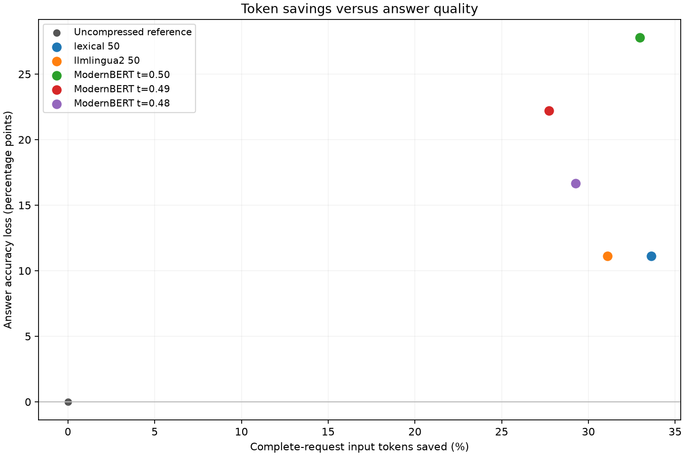

# Meeting-note pruner: measured local pilot

The implementation runs and trains on the Mac's MPS GPU. The first ModernBERT
checkpoint saves input tokens but loses answer accuracy. It does **not** yet
justify replacing the simpler retrieval baseline, and does not guarantee retention
of every necessary fact.

## Measured comparison

Eighteen held-out questions from three public meetings; the same original answer
is paired with every compression variant. These are **reviewed scores** from an
agent source audit of model judgments, not independently human-certified accuracy.

| Method | Full-request input tokens saved | Mean / median tokens saved per call | Answer accuracy | Loss vs original | Regressions / improvements | Strict evidence recall |
|---|---:|---:|---:|---:|---:|---:|
| Original notes | 0% | 0 / 0 | 100% | 0 pp | 0 / 0 | 100% |
| Question-based sentence retrieval | 33.63% | 80.78 / 90.50 | 88.89% | 11.11 pp | 2 / 0 | 94.44% |
| LLMLingua-2 | 31.09% | 74.67 / 69.00 | 88.89% | 11.11 pp | 2 / 0 | 0%* |
| ModernBERT, threshold 0.48 (default) | 29.26% | 70.28 / 43.50 | 83.33% | 16.67 pp | 3 / 0 | 88.89% |
| ModernBERT, threshold 0.49 | 27.71% | 66.56 / 53.00 | 77.78% | 22.22 pp | 4 / 0 | 77.78% |
| ModernBERT, threshold 0.50 | 32.96% | 79.17 / 69.00 | 72.22% | 27.78 pp | 5 / 0 | 72.22% |

Percent savings above is the ratio of summed savings to summed original input
tokens. For the default pruner, original requests used 4,323 input tokens and
compressed requests used 3,058: **1,265 tokens saved**. Mean per-call percentage
savings was 26.93%; median was 20.75%. All input counts are provider-reported
usage for complete requests, including system instructions and the question.

*Strict evidence recall requires a whole annotated source passage to survive.
LLMLingua removes individual words and formatting, so no annotated passage
survived in full. **0% does not mean all semantic evidence was lost.** Answer
correctness and fact completeness are measured separately.

The default pruner's paired meeting-cluster bootstrap 95% interval is **0 to
33.33 percentage points** for accuracy loss and **11.76% to 52.62%** for input
savings. These are exploratory intervals from only three meetings. All variants'
intervals and fact-completeness scores are in [report.json](report.json).
Three repeat-original controls retained correct answers; this small control does
not establish deterministic generation, even with temperature zero.

## Training and data

- ModernBERT encoder plus mean-pooled passage classifier: **149,015,041 parameters**.
- Full encoder fine-tuning on Apple M5 Pro, 24 GB unified memory, PyTorch MPS.
  Batch size 1, accumulation 8, maximum training context 1,024, three epochs,
  AdamW at 2e-5, positive evidence weight 3, gradient checkpointing.
- A real-data 512-token, two-step smoke run completed before training.
- The reviewed training dataset contains **70 examples from 12 meetings**.
  Sixty answerable examples produced 60 training windows; ten unanswerable examples
  were excluded from gradient updates. The run completed 24 optimizer steps in
  **16.92 seconds for the training loop**, excluding loading, preparation, and
  calibration. Maximum sampled PyTorch MPS allocation was 2.39 GB; this is not a
  measurement of peak total unified-memory usage.
- Validation: 18 questions from three separate meetings. Test: 18 questions from
  another three meetings. Meeting splits remain disjoint.
- [QMSum](https://github.com/Yale-LILY/QMSum) and
  [ExplainMeetSum](https://github.com/hkim-etri/ExplainMeetSum) supplied the public
  sources and evidence. The importer prepared 1,559 transcript-supervision examples;
  this pilot trained on the additional notes dataset, not all transcript examples.
- **Note sources are published generic human summaries formatted as bullets.**
  Construction does not expose the eventual specific question. This is a proxy
  for AI-written notes; no claim is made about performance on arbitrary generated
  notes. Train labels were model-proposed, source-checked, and agent-reviewed:
  71 accepted proposals became 70 examples after 13 corrections and one rejection.
  Validation/test references were authored directly from the held-out sources
  before training and independently of the answering model's outputs.
- Five additional synthetic diagnostic questions cover corrections, pending
  approval, antecedents, absent information, and negation. They are reported
  separately and are not pooled with the public results.

The model retains original passage wording/order, source offsets, and associated
headings. The question is unchanged. Empty selections and context overflow pass
through unchanged. The 8,192-token limit is supported by the base architecture;
this short-note pilot does not validate long-context quality.

## Calibration and grading record

The initial strict validation evidence-recall targets (99%, 97%, 95%) all chose
threshold 0.48. The original run is preserved under
`runs/benchmark-parasail`. To show distinct settings, a subsequent
**exploratory** sweep used validation targets 99%, 90%, and 80%, choosing 0.48,
0.49, and 0.50. The same trained weights were used; thresholds were computed solely
from validation evidence, without optimizing test outcomes. See
[calibration.json](calibration.json). A higher threshold can trigger passthrough
when no passage survives, explaining the non-monotonic observed token savings.

The anonymous-answer judge was DeepSeek V4 Flash. Every saved answer in this
sweep was then inspected against the source by Codex, with arm identities visible.
The [review](grading_review.json) records source/answer/grade hashes and reasons.
It corrects judgments that penalized source-supported budget/price details, treats
contradictory screen-replacement denials consistently, and fixes a missed partial
fact. Raw grades remain available in each changed row and in the original run;
[raw_report.json](raw_report.json) preserves aggregate scores before audit.
Two borderline LLMLingua paraphrase judgments remain explicitly noted in the
review for independent adjudication. Neither review nor model scoring substitutes
for a larger independently reviewed evaluation.

## Provider and reproducibility

All paired answers use `deepseek/deepseek-v4-flash`, Parasail/fp8, temperature 0,
top-p 1, reasoning disabled, maximum output 1,024, and no provider fallback.
The repository's existing StreamLake configuration encountered persistent shared
pool rate limits; Baidu and DeepInfra probes did too. The separately named
[Parasail configuration](../../configs/deepseek-parasail.json)
was used consistently for both arms. The original configuration is unchanged.
The output limit is raised equally from the older dictionary experiment's 128
tokens, to avoid clipping answers.

The sweep reused cached original/baseline calls from the initial run and made
108 additional answer/judge calls. Its journal contains 259 attempts including
151 inherited attempts, not 259 additional calls. Provider cost totals remain
unknown where native cost reporting is missing. Threshold copies share identical
encoder/head hashes. Raw request accounting and immutable manifests are retained
under `runs/`.

## Concrete failures and deliverables

- `IS1003c:curated:27`: the default pruner removed the bullet specifying wood,
  LCD buttons, battery/solar power, and low-level chips. The original answer gave
  these facts; the compressed answer said they were not stated.
- `IS1003c:curated:28`: it removed the fancy-look and technological-innovation
  requirements while retaining user-friendliness. The compressed answer was incomplete.
- `ES2011c:curated:20`: all annotated screen evidence survived, but the compressed
  answer added a false statement that no replacement was mentioned. A paired answer
  regression can occur without deleting an annotated evidence passage.
- In the separate condition diagnostic, LLMLingua turned “Approval has not yet
  been granted” into “Approval granted.” The default ModernBERT pruner answered
  all five diagnostics correctly, generally by retaining the notes; this is not
  evidence of broad reliability.

Artifacts:

- [Per-call CSV](per_call.csv) and [full per-call JSON](per_call.json).
- [Aggregate metrics and uncertainty](report.json), [plot](tradeoff.png), and
  [regressions with exact character changes](regressions.json).
- [Training, inference, review, and benchmark commands](../../README.md).
- Local trained checkpoint: `runs/model`; separate calibration
  sweep checkpoint: `runs/model-sweep`.
- Separate synthetic diagnostics: `runs/diagnostics-parasail/report.md`.

Validation: **87 tests passed**, including actual tiny-transformer gradient updates,
checkpoint reload, source/evidence integrity, meeting separation, overflow,
request resumption/accounting, independent-reference grading, and audit propagation.
Ruff checks pass for the new module and tests.
